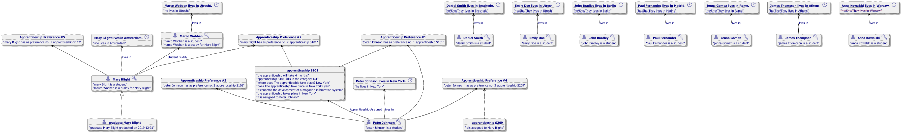
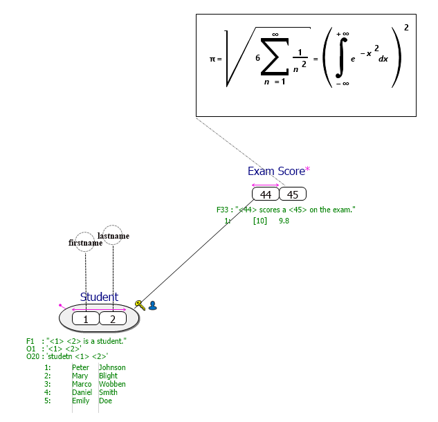
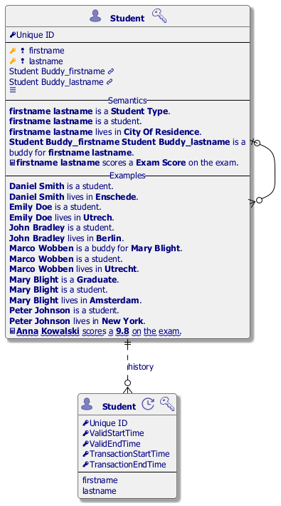
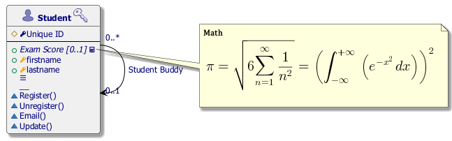
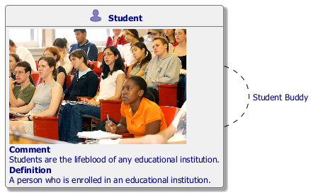
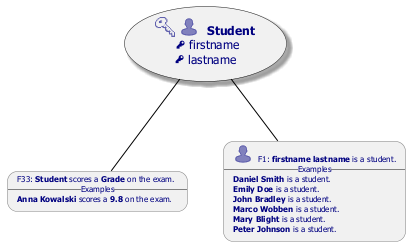
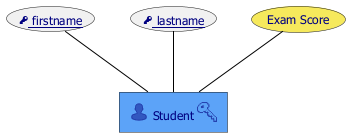
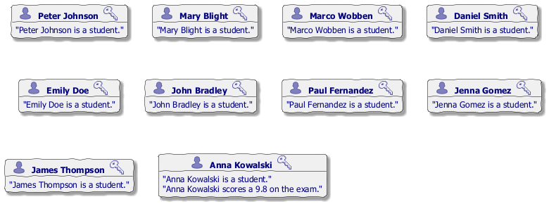

#  apprenticeship.prj
*Project created with CaseTalk v14.2 Build 3.56993.*

*  apprenticeship.prj

  *  apprenticeship.ig

    *  apprenticeship.exp

    *  apprenticeship.igd

## apprenticeship.igd / Fact Model

## apprenticeship.igd / Logical Model

## apprenticeship.igd / UML Classes

## apprenticeship.igd / Concept Map

## apprenticeship.igd / Object types

## apprenticeship.igd / Entity-Relation Model

## apprenticeship.igd / Knowledge Graph

    *  Assigned.igd

## Assigned.igd / Fact Model

## Assigned.igd / Logical Model

## Assigned.igd / UML Classes

## Assigned.igd / Concept Map

## Assigned.igd / Object types

## Assigned.igd / Entity-Relation Model

## Assigned.igd / Knowledge Graph

    *  Apprenticeship.rtf

    *  apprenticeship_Postgresql_init.SQL

    *  apprenticeship_Postgresql_create.SQL

    *  apprenticeship_Postgresql_load.SQL

    *  apprenticeship_Postgresql_protect.SQL

    *  apprenticeship_Postgresql_access.SQL

    *  apprenticeship_Postgresql_noaccess.SQL

    *  apprenticeship_Postgresql_unload.SQL

    *  apprenticeship_Postgresql_drop.SQL

    *  apprenticeship_Postgresql.log

    *  apprenticeship_Postgresql.json

    *  apprenticeship_OWL2.rdf

  *  apprenticeship.igd.html

  *  apprenticeship.pdf

  *  Assigned.igd.html

