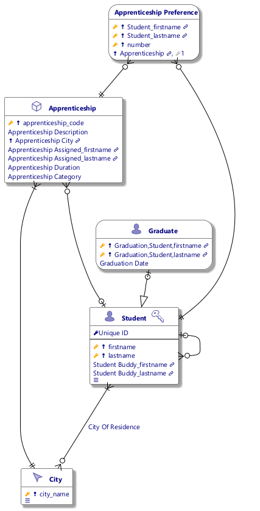

#  apprenticeship.prj
*Project created with CaseTalk v12.8 Build 0.55140.*

*  apprenticeship.prj
  *  apprenticeship.ig
    *  apprenticeship.exp
    *  Apprenticeship.igd
## Apprenticeship.igd

## Apprenticeship.igd /ERD

## Apprenticeship.igd /UML

## Apprenticeship.igd /MAP

## Apprenticeship.igd /EXP

