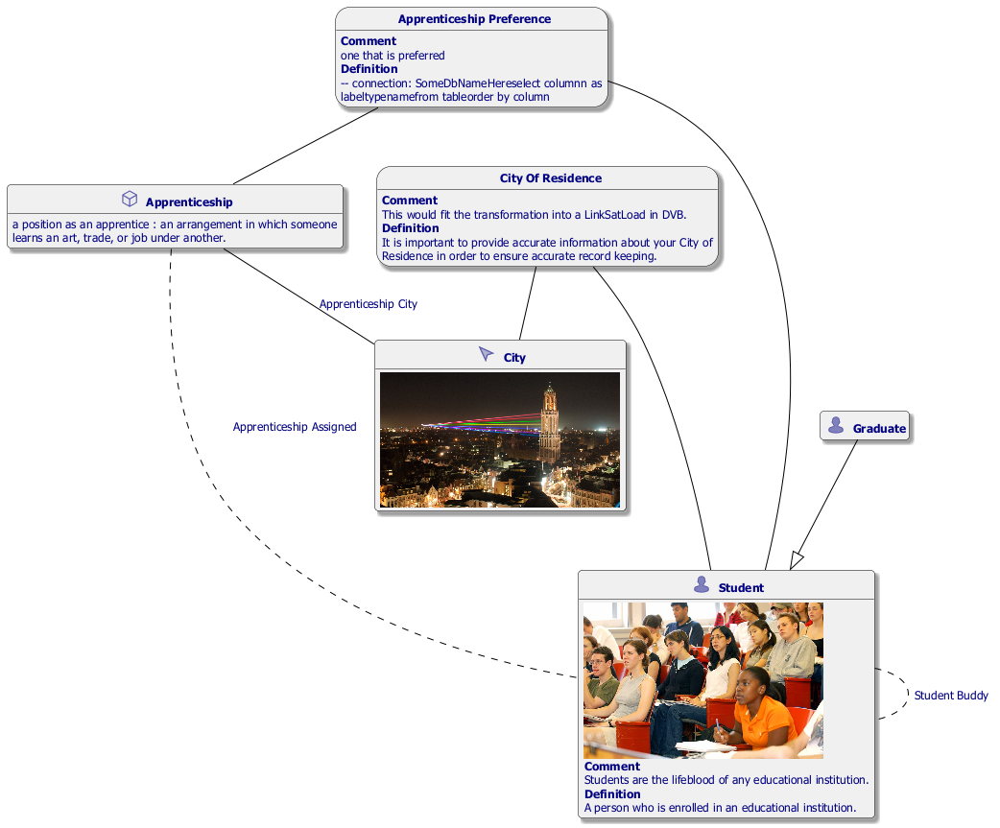

#  apprenticeship.prj
*Project created with CaseTalk v12.6 Build 3.31264.*

*  apprenticeship.prj
  *  apprenticeship.ig
    *  apprenticeship.exp
    *  Apprenticeship.igd
    *  apprenticeship_OWL2.rdf
    *  SourceDbMapping.plantuml
    *  spaCy Training Data.py
    *  apprenticeship_OOPascal.PAS
## Apprenticeship.igd

## Apprenticeship.igd /ERD

## Apprenticeship.igd /UML

## Apprenticeship.igd /MAP

## Apprenticeship.igd /EXP

