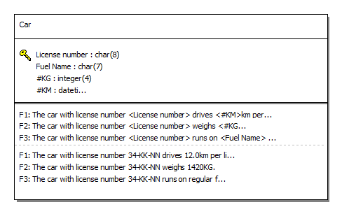
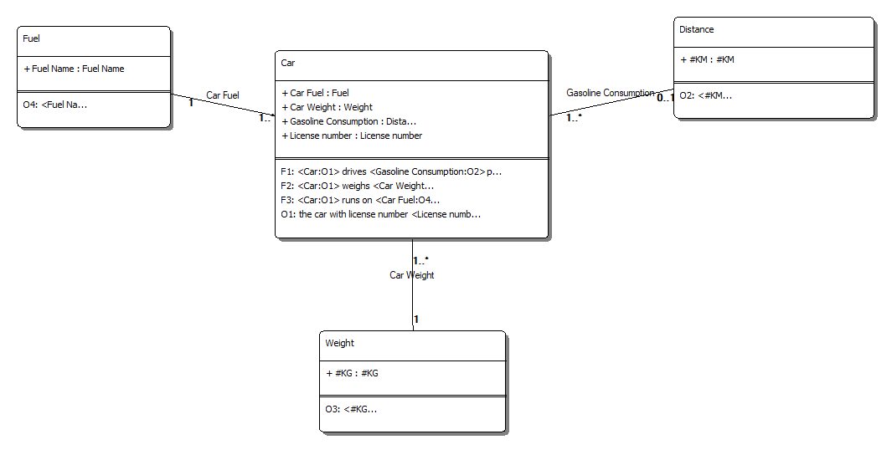

#  CarFuel.prj
A simple example to illustrate the table as designed in any relational casetool lacks semantics. The columns require meaning.

*Project created with CaseTalk v8.30, release 2, build 4450.*

*  CarFuel.prj
  *  CarFuel.ig
    *  carFuel.igd
    *  CarFuel.exp
    *  CarFuel_GLR.igg
      *  CarFuel_GLR_SQL92.SQL
      *  CarFuel-Logical.CRD
      *  CarFuel-UML.CUD
## carFuel.igd

## CarFuel-Logical.CRD

## CarFuel-UML.CUD

