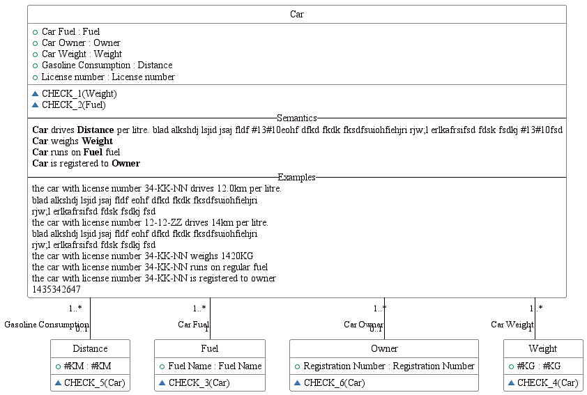
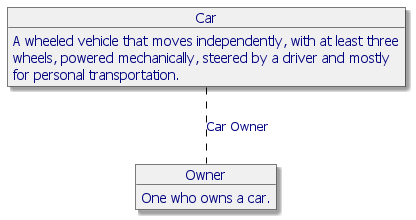

#  CarFuel.prj
A simple example to illustrate the table as designed in any relational casetool lacks semantics. The columns require meaning.

*Project created with CaseTalk v12.4 Build 2.28751.*

*  CarFuel.prj
  *  CarFuel.ig
    *  carFuel.igd
## carFuel.igd

## carFuel.igd /ERD

## carFuel.igd /UML

## carFuel.igd /MAP

