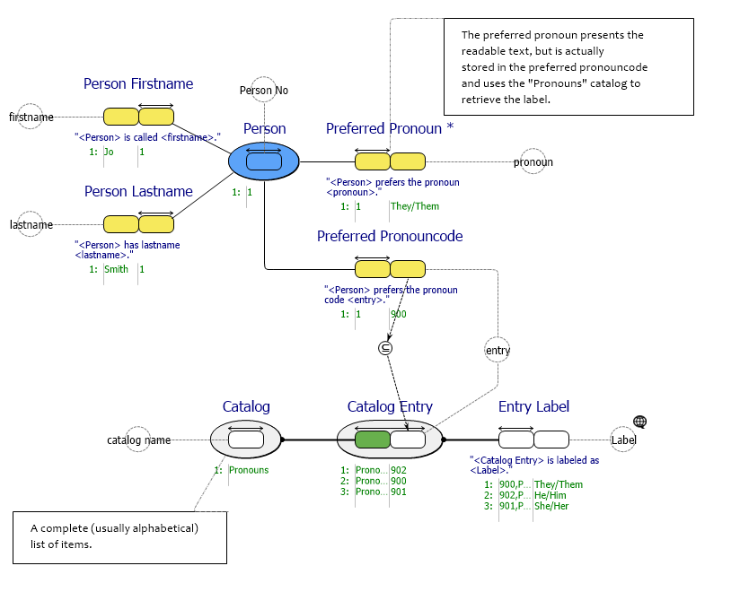
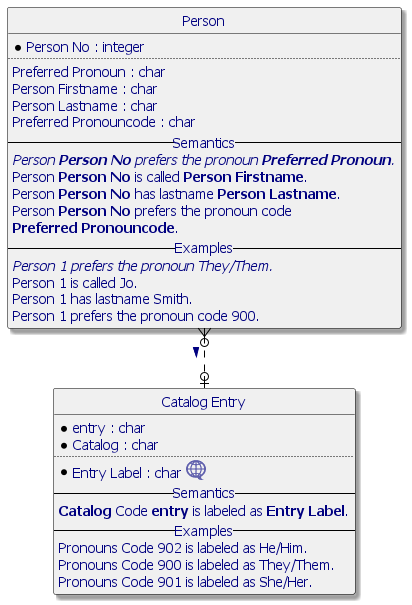

#  Catalog Entry.prj
*Project created with CaseTalk v12.6 Build 0.30996.*

*  Catalog Entry.prj
  *  catalog entry.ig
    *  employee.igd
## employee.igd

## employee.igd /ERD

## employee.igd /UML

## employee.igd /MAP

## employee.igd /EXP

