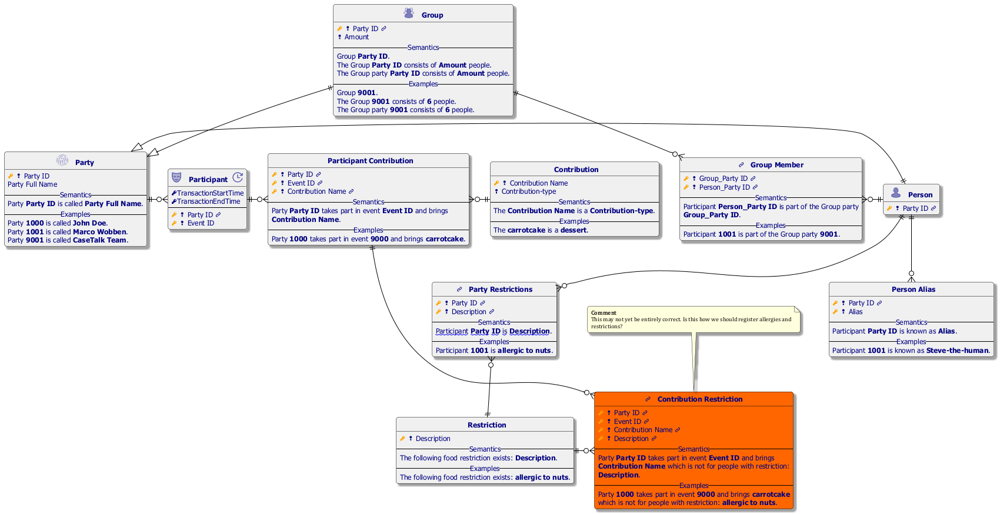
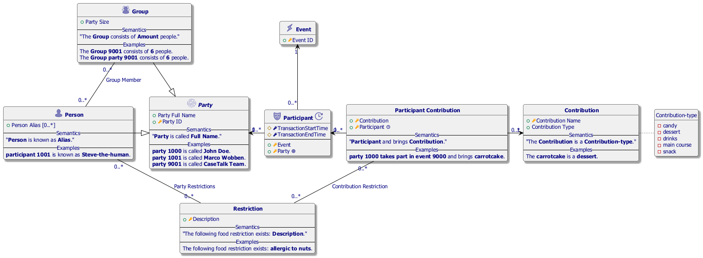
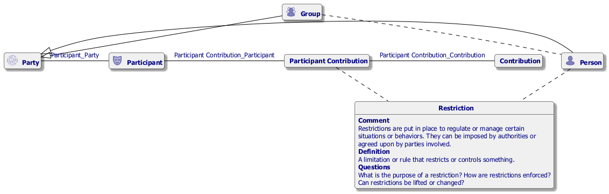
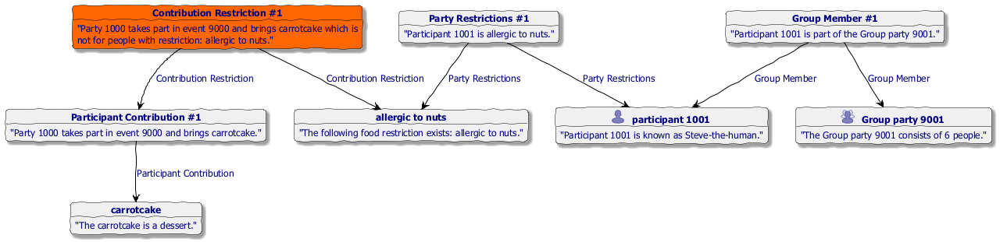

#  Picnic.prj
*Project created with CaseTalk v14.2 Build 0.56772.*

* Picnic.prj

  * picnic.ig

    * Party.igd

## Party.igd

## Party.igd /ERD

## Party.igd /UML

## Party.igd /MAP

## Party.igd /EXP

## Party.igd /ER

## Party.igd /KG

  * picnic.html

