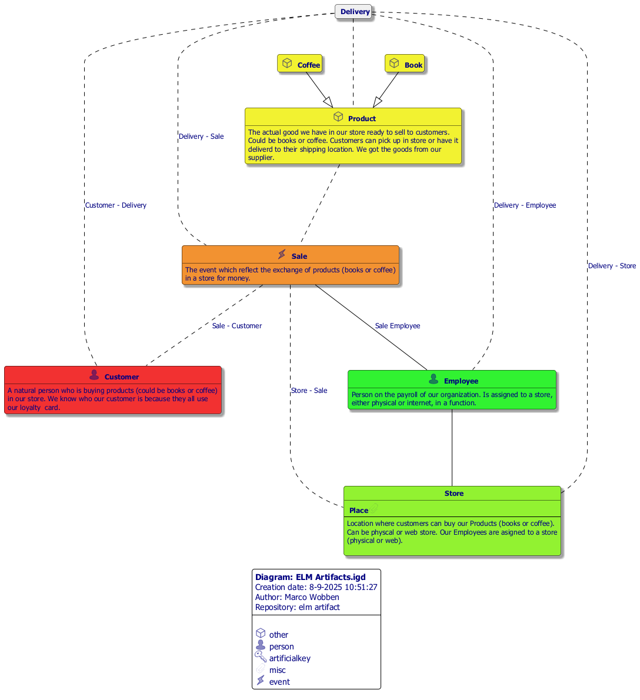

#  ELM Artifact.prj
*Project created with CaseTalk v13.0 Build 1.55378.*

*  ELM Artifact.prj
  *  elm artifact.ig
    *  CBC List and CBC Forms_v2021_example_v03_to_share.xls
    *  ELM Artifacts.igd

## ELM Artifacts.igd
 

## ELM Artifacts.igd /UML
 

## ELM Artifacts.igd /MAP
 

## ELM Artifacts.igd /EXP
 
