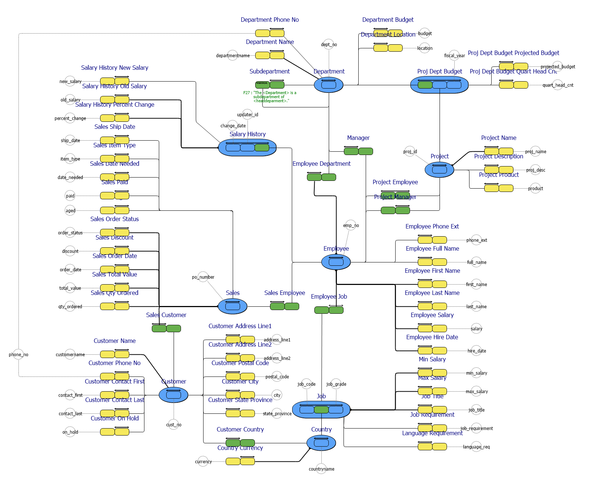

# employee.prj
Reverse engineered to a Fact Based Model in CaseTalk.
The source database is an example deployment taken from an Interbase/Firebird database.

*Project created with CaseTalk v8.29, release 1, build 4386.*

*  employee.prj
  *  employee.ig
    *  job.igd
    *  project.igd
    *  sales.igd
    *  customer.igd
    *  all.igd
## job.igd

## project.igd

## sales.igd

## customer.igd

## all.igd

