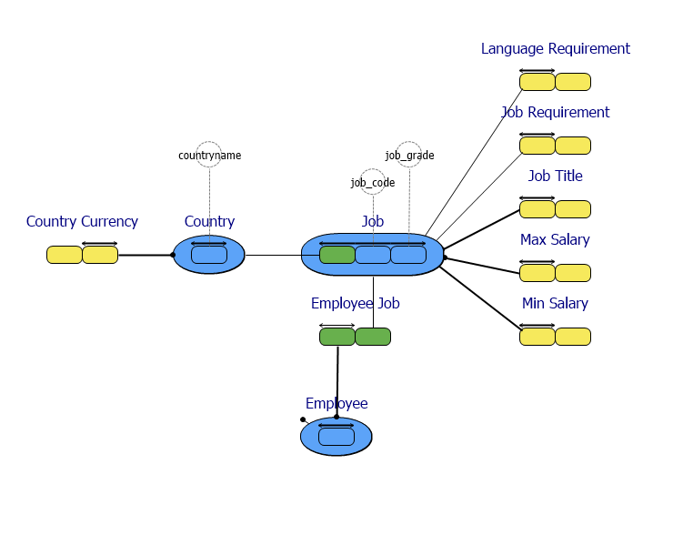
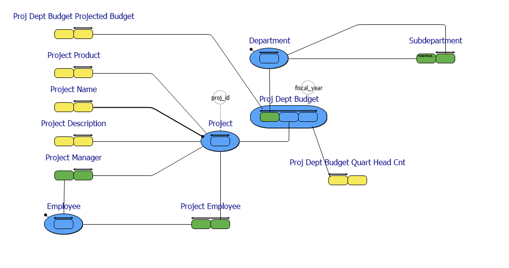

#  employee.prj
Reverse engineered to a Fact Based Model in CaseTalk.
The source database is an example deployment taken from an Interbase/Firebird database.

*Project created with CaseTalk v8.27, release 1, build 4349.*

* employee.prj
  * employee.ig
    * job.igd
    * project.igd
    * sales.igd
    * customer.igd
    * all.igd
## job.igd

## project.igd

## sales.igd

## customer.igd

## all.igd

