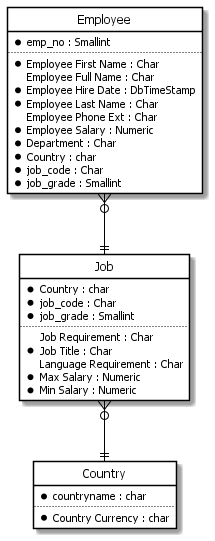
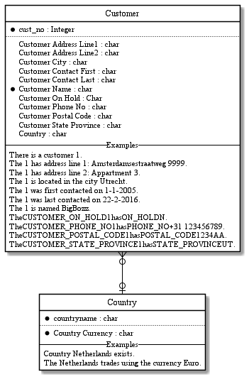
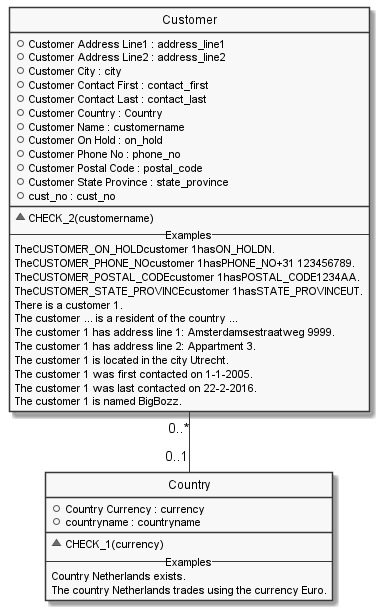
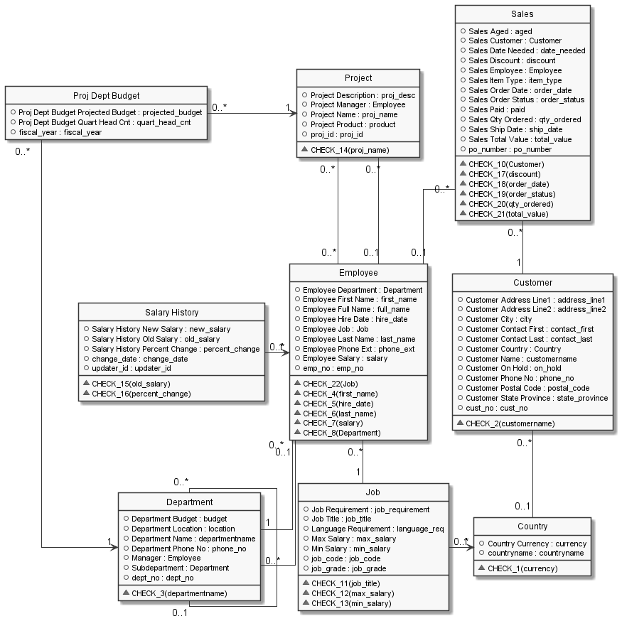

#  employee.prj
Reverse engineered to a Fact Based Model in CaseTalk.
The source database is an example deployment taken from an Interbase/Firebird database.

*Project created with CaseTalk v12.4 Build 2.28837.*

*  employee.prj
  *  employee.ig
    *  job.igd
    *  project.igd
    *  sales.igd
    *  customer.igd
    *  all.igd
    *  Department.igd
## job.igd

## job.igd /ERD

## job.igd /UML

## job.igd /MAP

## project.igd

## project.igd /ERD

## project.igd /UML

## project.igd /MAP

## sales.igd

## sales.igd /ERD

## sales.igd /UML

## sales.igd /MAP

## customer.igd

## customer.igd /ERD

## customer.igd /UML

## customer.igd /MAP

## all.igd

## all.igd /ERD

## all.igd /UML

## all.igd /MAP

## Department.igd

## Department.igd /ERD

## Department.igd /UML

## Department.igd /MAP

