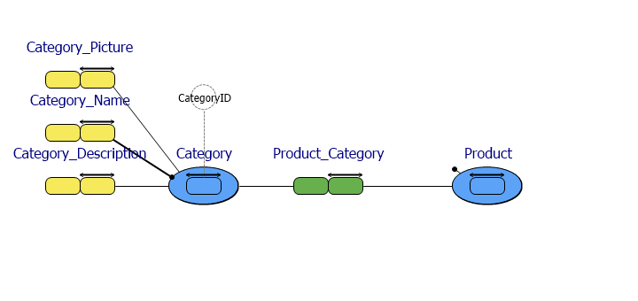
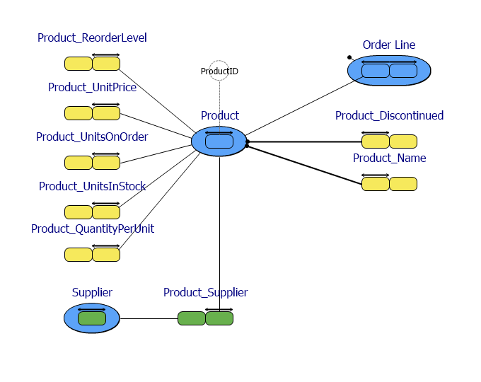
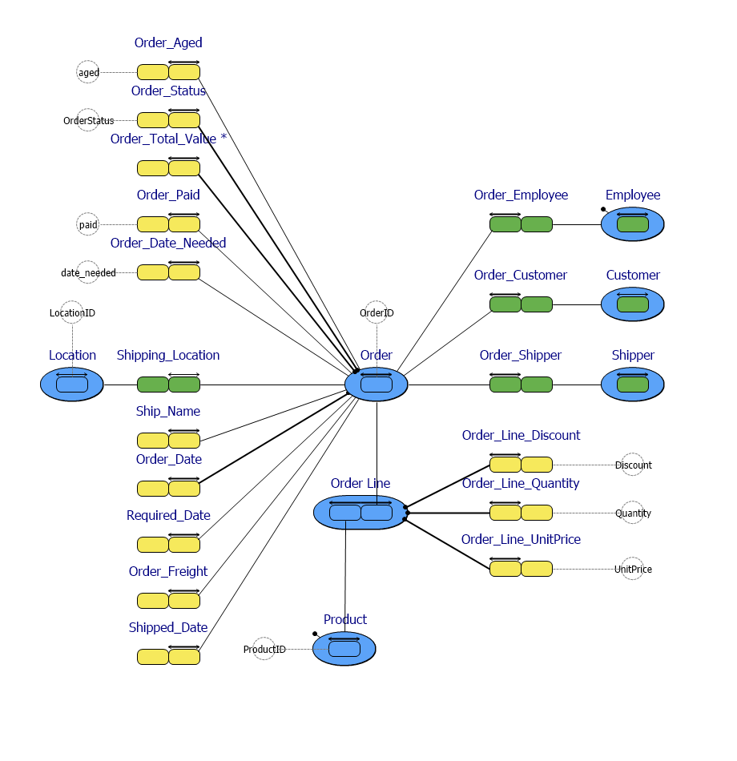
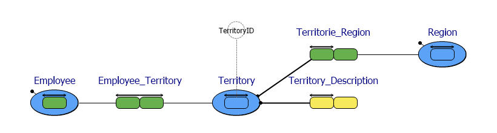
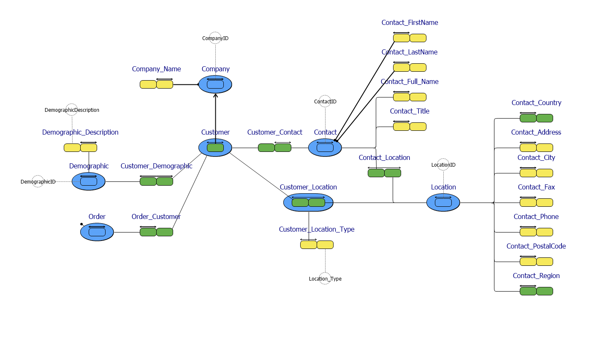
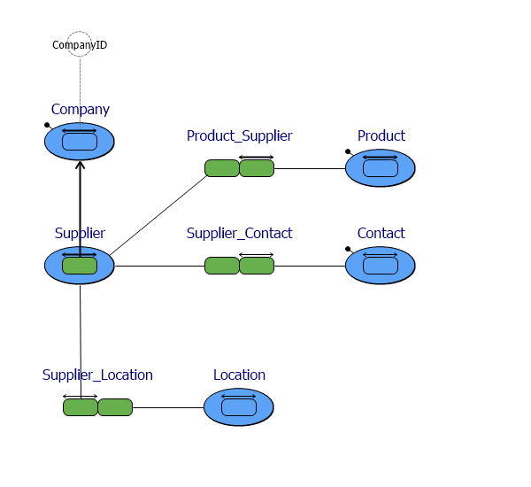

# NorthwindAndEmployee.prj
*Project created with CaseTalk v8.27, release 1, build 4349.*

*  NorthwindAndEmployee.prj
  *  NorthwindAndEmployee.ig
    *  categories.igd
    *  products.igd
    *  orders.igd
    *  employees.igd
    *  territories.igd
    *  regions.igd
    *  customers.igd
    *  shippers.igd
    *  suppliers.igd
## categories.igd

## products.igd

## orders.igd

## employees.igd

## territories.igd

## regions.igd

## customers.igd

## shippers.igd

## suppliers.igd

