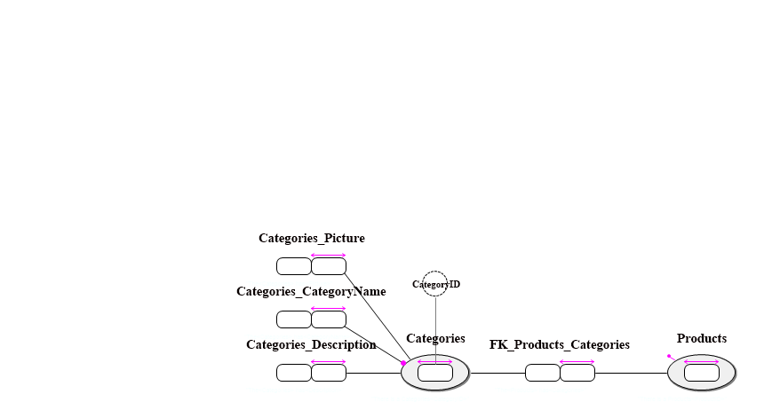
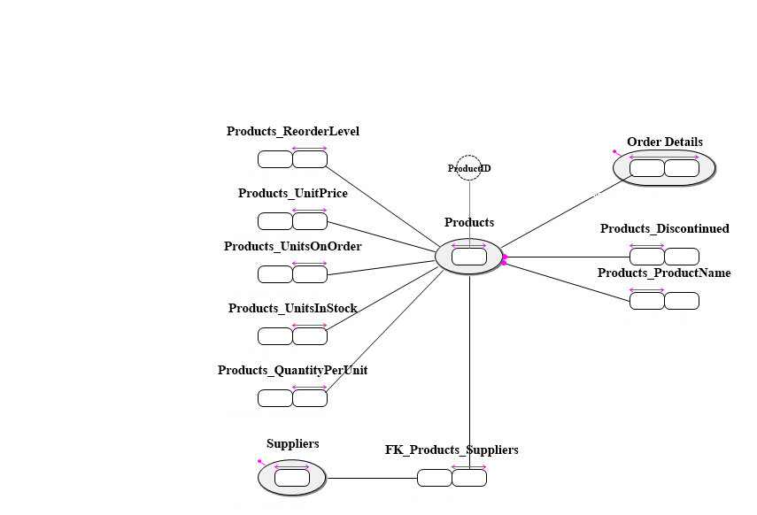
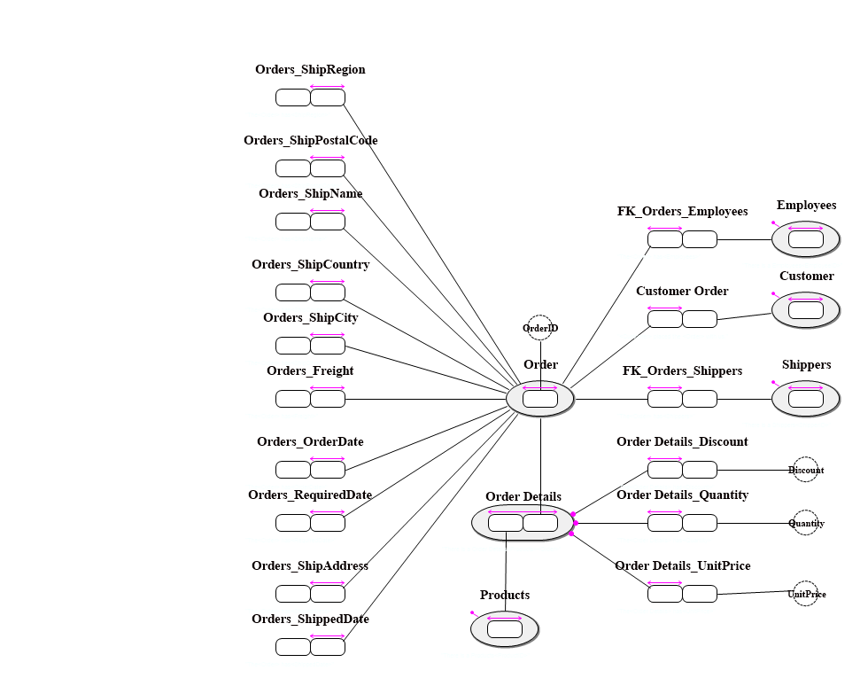
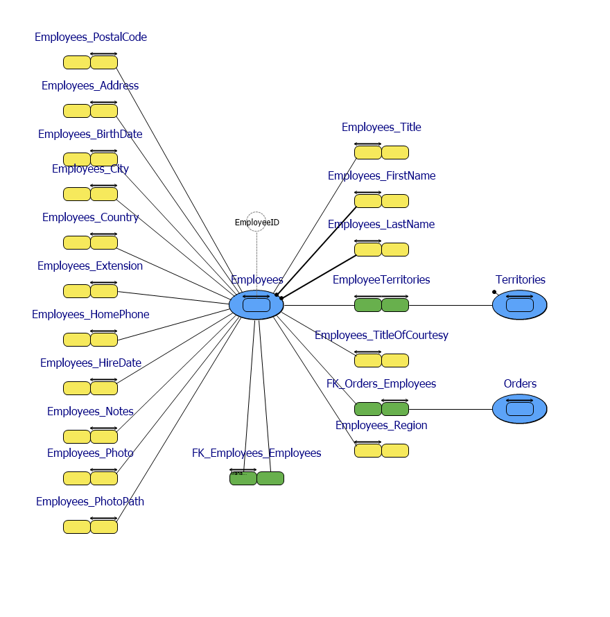
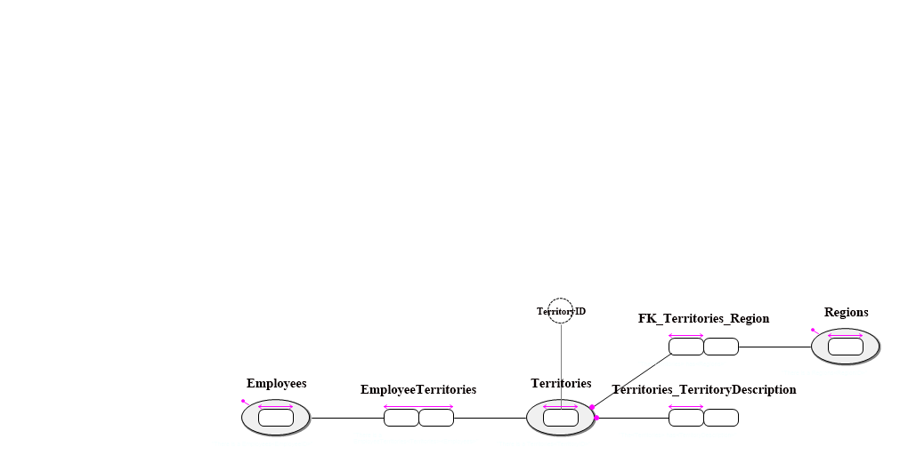
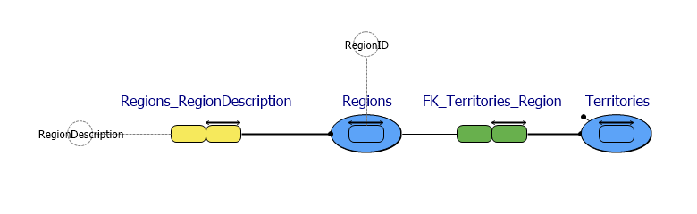
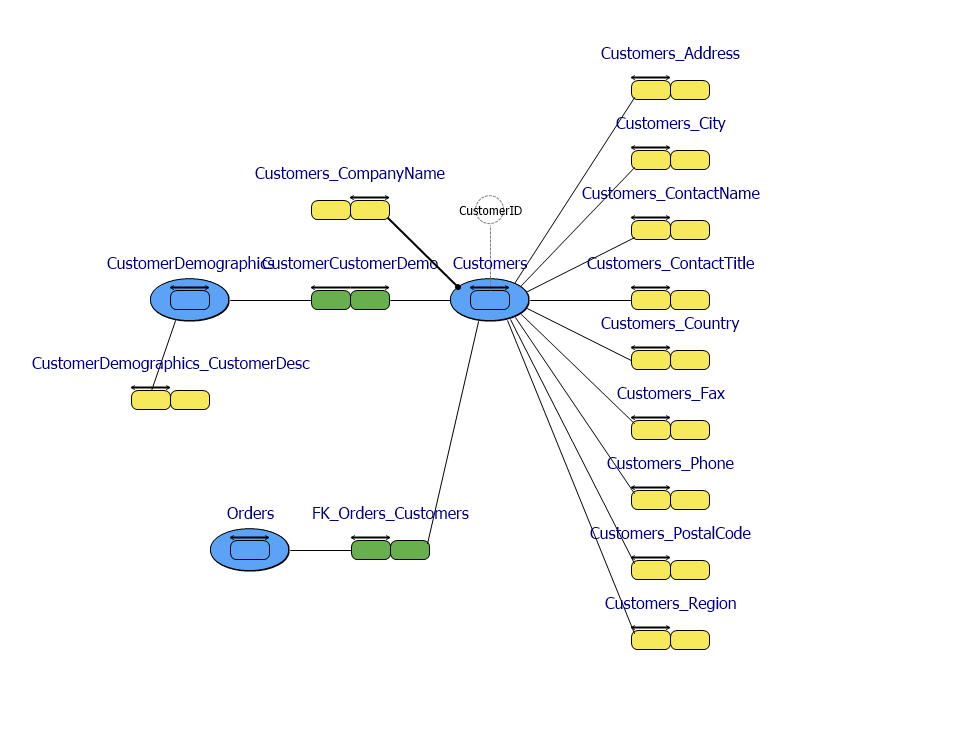
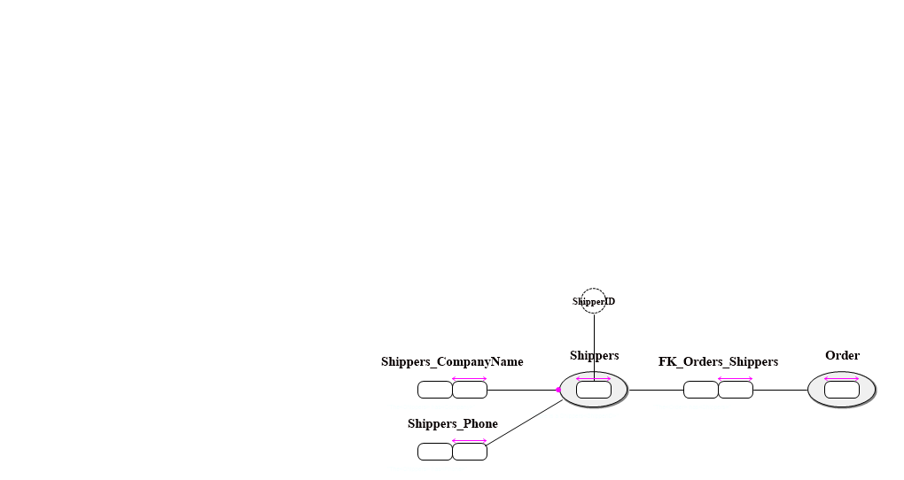
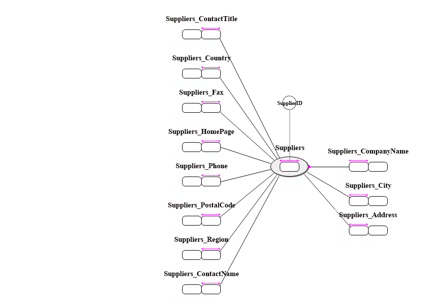

#  Northwind.prj
This model is generated from reverse engineering the well known Northwind example database in MsSQLServer.

*Project created with CaseTalk v8.27, release 1, build 4349.*

* Northwind.prj
  * northwind.ig
    * categories.igd
    * products.igd
    * orders.igd
    * employees.igd
    * territories.igd
    * regions.igd
    * customers.igd
    * shippers.igd
    * suppliers.igd
## categories.igd

## products.igd

## orders.igd

## employees.igd

## territories.igd

## regions.igd

## customers.igd

## shippers.igd

## suppliers.igd

