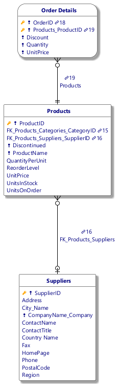
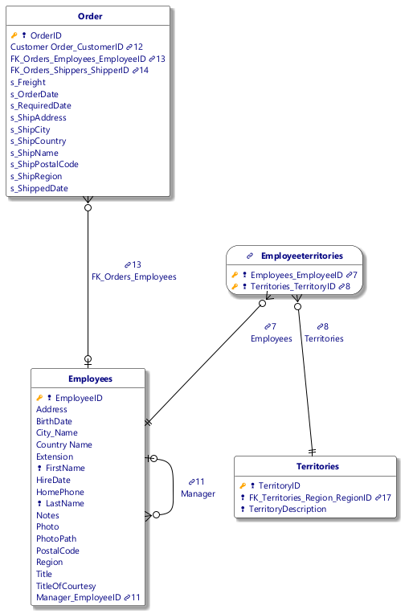
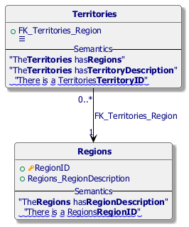
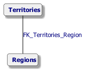
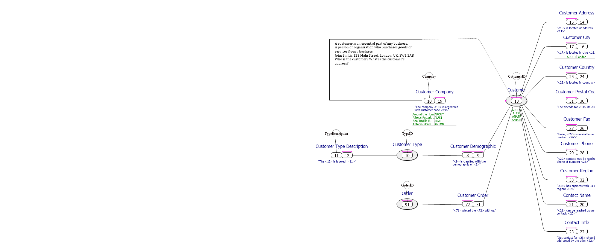
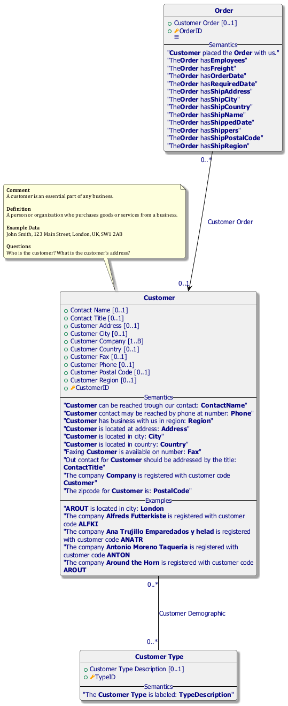
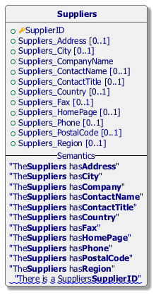
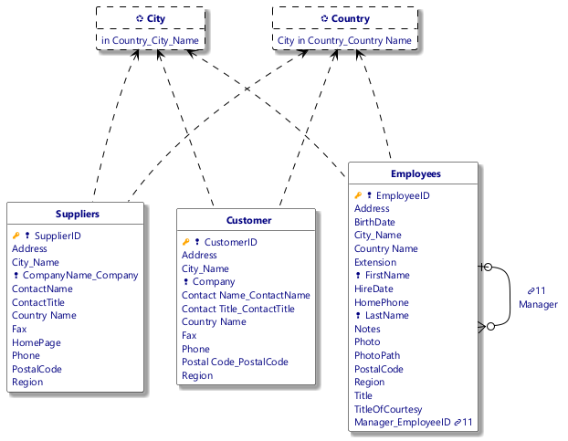

#  Northwind.prj
*Project created with CaseTalk v14.3 Build 1.57024.*

*  Northwind.prj

  *  northwind.ig

    *  categories.igd

## categories.igd / Fact Model

## categories.igd / Logical Model

## categories.igd / UML Classes

## categories.igd / Concept Map

## categories.igd / Entity-Relation Model

## categories.igd / Knowledge Graph

    *  products.igd

## products.igd / Fact Model

## products.igd / Logical Model

## products.igd / UML Classes

## products.igd / Concept Map

## products.igd / Entity-Relation Model

## products.igd / Knowledge Graph

    *  orders.igd

## orders.igd / Fact Model

## orders.igd / Logical Model

## orders.igd / UML Classes

## orders.igd / Concept Map

## orders.igd / Entity-Relation Model

## orders.igd / Knowledge Graph

    *  employees.igd

## employees.igd / Fact Model

## employees.igd / Logical Model

## employees.igd / UML Classes

## employees.igd / Concept Map

## employees.igd / Entity-Relation Model

## employees.igd / Knowledge Graph

    *  territories.igd

## territories.igd / Fact Model

## territories.igd / Logical Model

## territories.igd / UML Classes

## territories.igd / Concept Map

## territories.igd / Entity-Relation Model

## territories.igd / Knowledge Graph

    *  regions.igd

## regions.igd / Fact Model

## regions.igd / Logical Model

## regions.igd / UML Classes

## regions.igd / Concept Map

## regions.igd / Entity-Relation Model

## regions.igd / Knowledge Graph

    *  customers.igd

## customers.igd / Fact Model

## customers.igd / Logical Model

## customers.igd / UML Classes

## customers.igd / Concept Map

## customers.igd / Object types

## customers.igd / Entity-Relation Model

## customers.igd / Knowledge Graph

    *  shippers.igd

## shippers.igd / Fact Model

## shippers.igd / Logical Model

## shippers.igd / UML Classes

## shippers.igd / Concept Map

## shippers.igd / Entity-Relation Model

## shippers.igd / Knowledge Graph

    *  suppliers.igd

## suppliers.igd / Fact Model

## suppliers.igd / Logical Model

## suppliers.igd / UML Classes

## suppliers.igd / Concept Map

## suppliers.igd / Entity-Relation Model

## suppliers.igd / Knowledge Graph

    *  Location.igd

## Location.igd / Fact Model

## Location.igd / Logical Model

## Location.igd / UML Classes

## Location.igd / Concept Map

## Location.igd / Object types

## Location.igd / Entity-Relation Model

## Location.igd / Knowledge Graph

