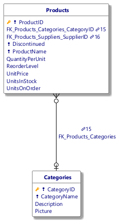
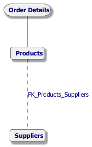
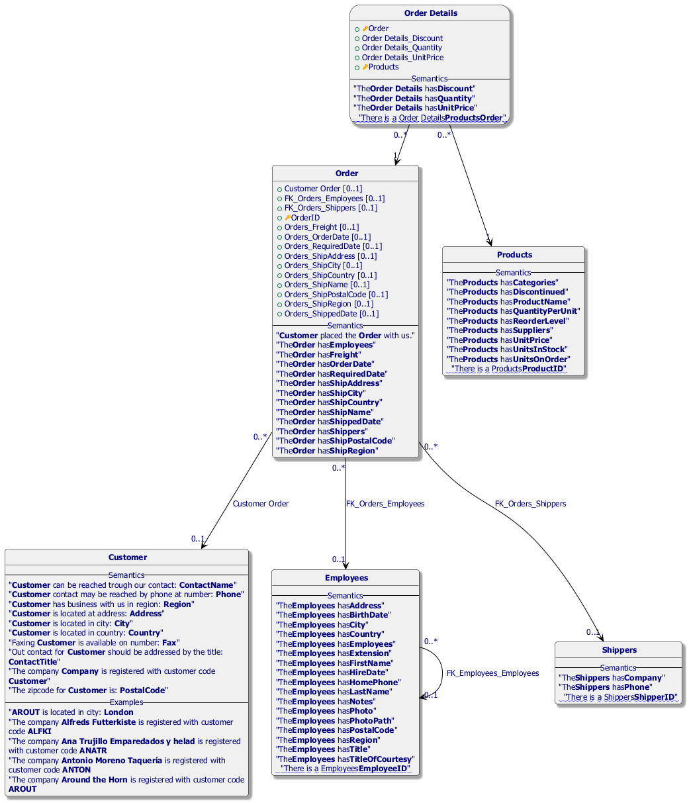
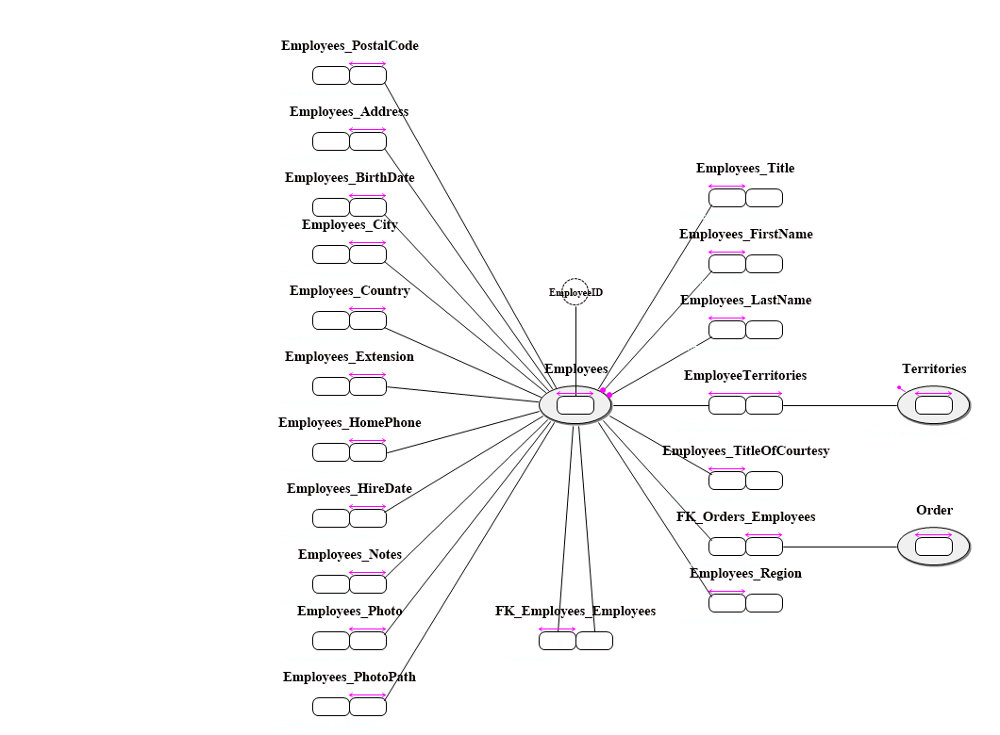
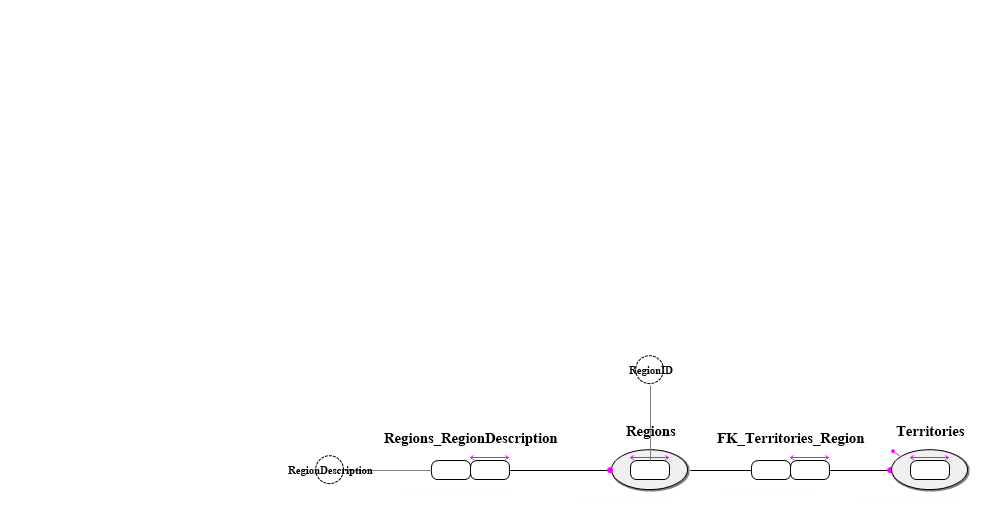
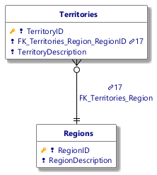
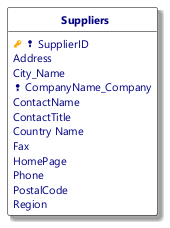

#  Northwind.prj
This model is generated from reverse engineering the well known Northwind example database in MsSQLServer.

*Project created with CaseTalk v12.4 Build 2.28751.*

*  Northwind.prj
  *  northwind.ig
    *  categories.igd
    *  products.igd
    *  orders.igd
    *  employees.igd
    *  territories.igd
    *  regions.igd
    *  customers.igd
    *  shippers.igd
    *  suppliers.igd
## categories.igd

## categories.igd /ERD

## categories.igd /UML

## categories.igd /MAP

## products.igd

## products.igd /ERD

## products.igd /UML

## products.igd /MAP

## orders.igd

## orders.igd /ERD

## orders.igd /UML

## orders.igd /MAP

## employees.igd

## employees.igd /ERD

## employees.igd /UML

## employees.igd /MAP

## territories.igd

## territories.igd /ERD

## territories.igd /UML

## territories.igd /MAP

## regions.igd

## regions.igd /ERD

## regions.igd /UML

## regions.igd /MAP

## customers.igd

## customers.igd /ERD

## customers.igd /UML

## customers.igd /MAP

## shippers.igd

## shippers.igd /ERD

## shippers.igd /UML

## shippers.igd /MAP

## suppliers.igd

## suppliers.igd /ERD

## suppliers.igd /UML

## suppliers.igd /MAP

