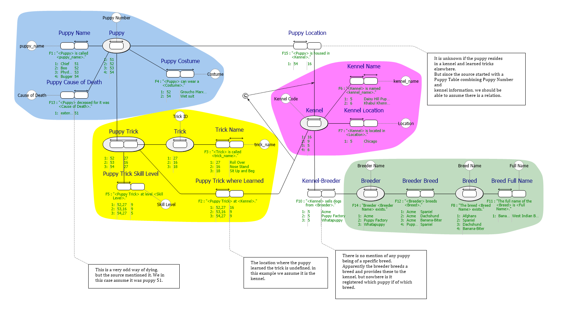
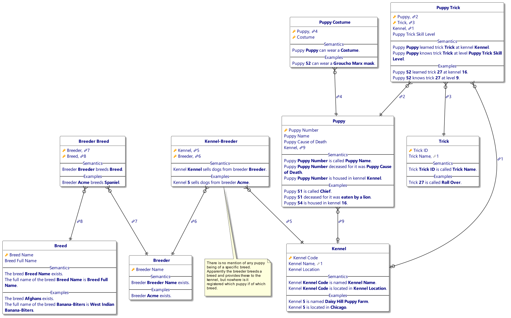
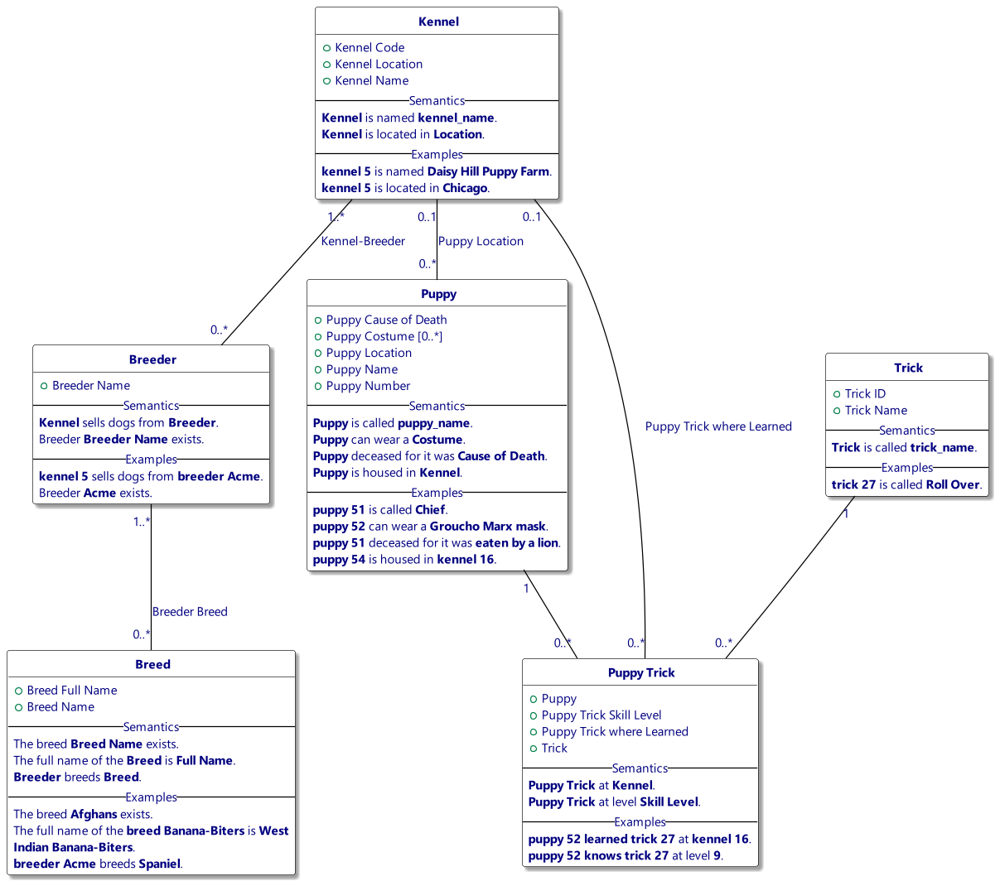
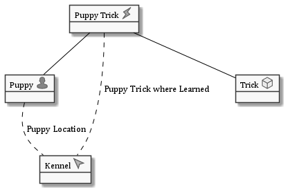
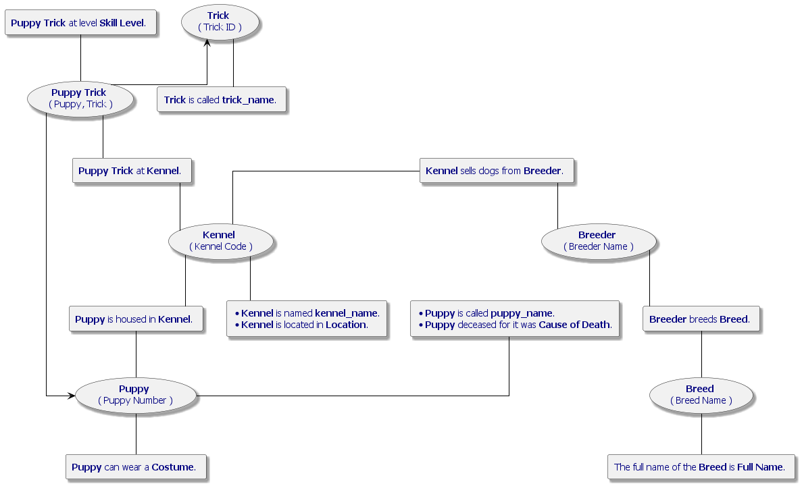
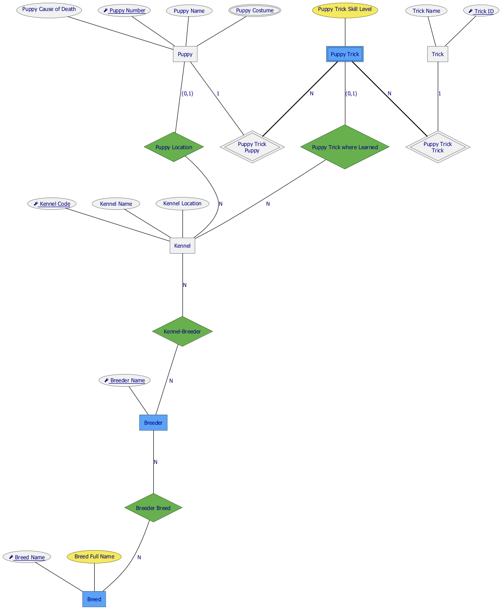
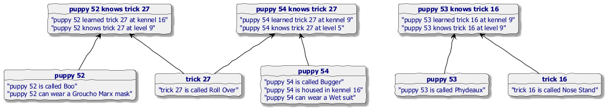

#  puppytricks.prj
*Project created with CaseTalk v14.3 Build 1.57024.*

*  puppytricks.prj

  *  puppytricks.ig

    *  puppytricks.exp

    *  puppytricks.igd

## puppytricks.igd / Fact Model

## puppytricks.igd / Logical Model

## puppytricks.igd / UML Classes

## puppytricks.igd / Concept Map

## puppytricks.igd / Object types

## puppytricks.igd / Entity-Relation Model

## puppytricks.igd / Knowledge Graph

