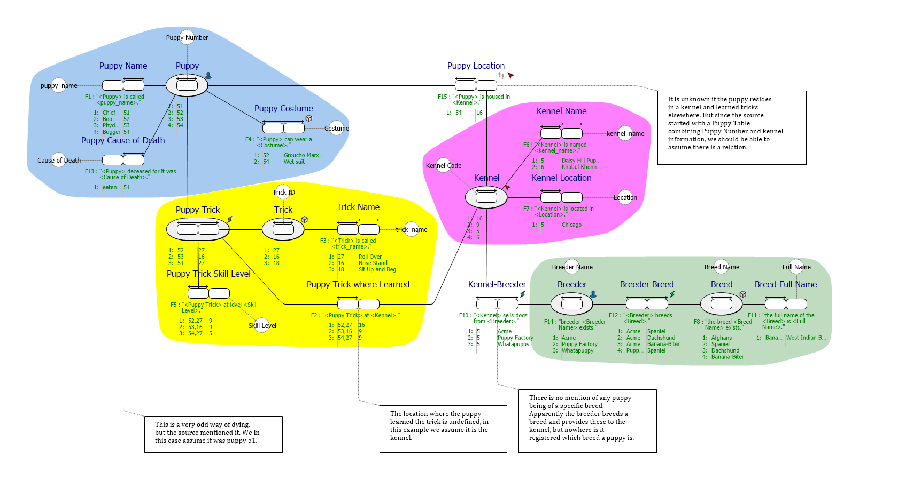
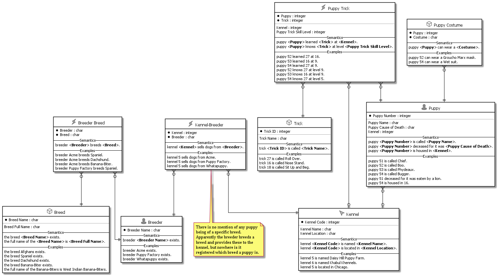
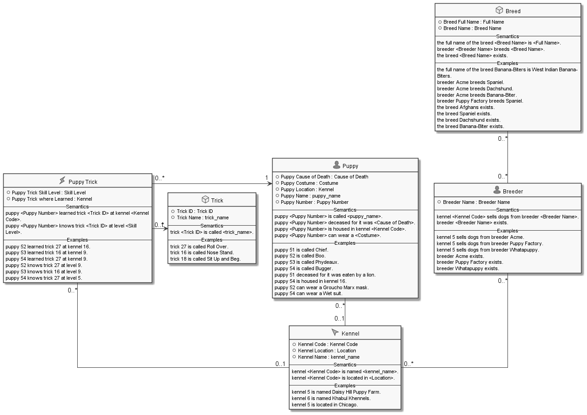
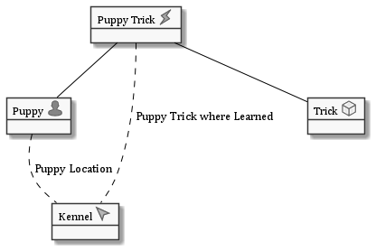

#  Puppy Tricks.prj
*Project created with CaseTalk v12.4 Build 3.28868.*

*  Puppy Tricks.prj
  *  puppy tricks.ig
    *  puppy tricks.exp
    *  Puppy Tricks.igd
## Puppy Tricks.igd

## Puppy Tricks.igd /ERD

## Puppy Tricks.igd /UML

## Puppy Tricks.igd /MAP

