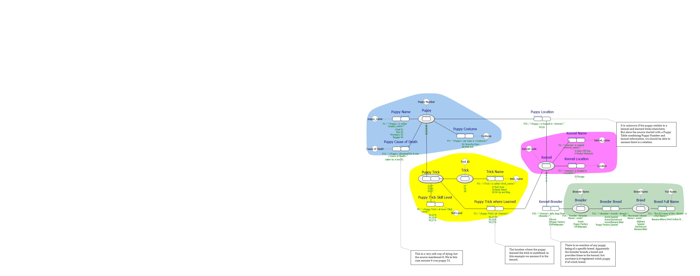
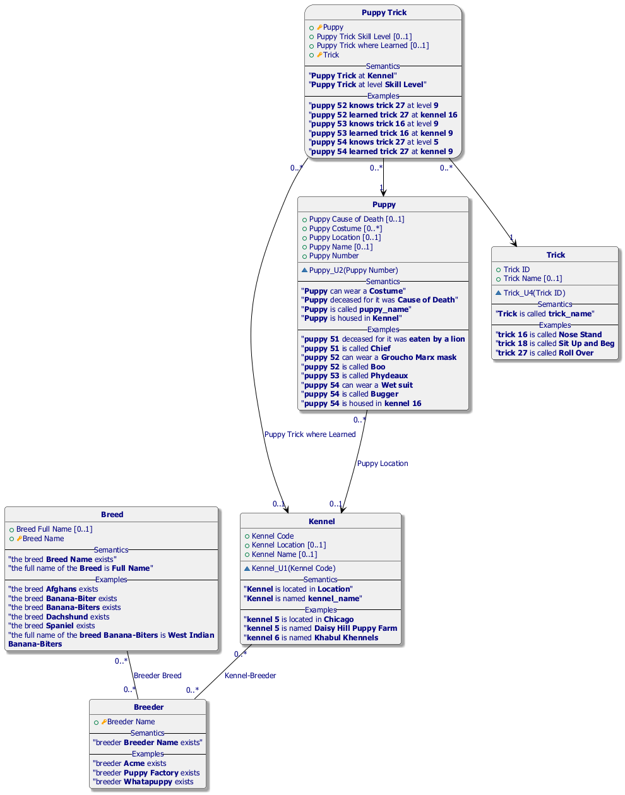
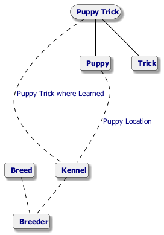

#  puppytricks.prj
[Description]
This model is loosely based upon the a poster used in the article by Thomas Frisendal.
The article is here:
https://www.dataversity.net/say-hello-to-graph-normal-form-gnf/#

And the poster is about normalization. Though aged, containing
*Project created with CaseTalk v12.6 Build 0.30996.*

*  puppytricks.prj
  *  puppytricks.ig
    *  puppytricks.exp
    *  puppytricks.igd
## puppytricks.igd

## puppytricks.igd /ERD

## puppytricks.igd /UML

## puppytricks.igd /MAP

## puppytricks.igd /EXP

