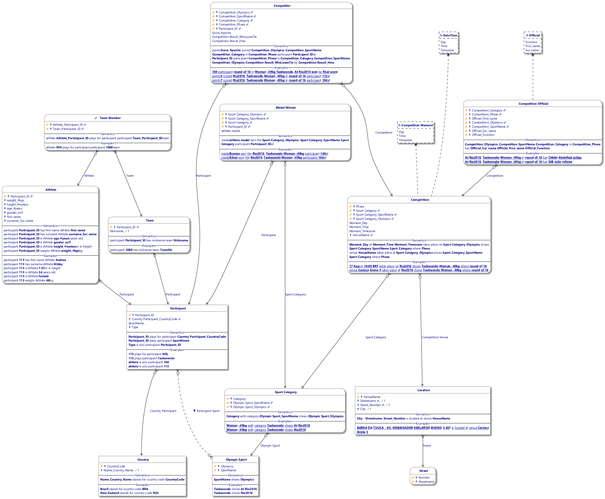
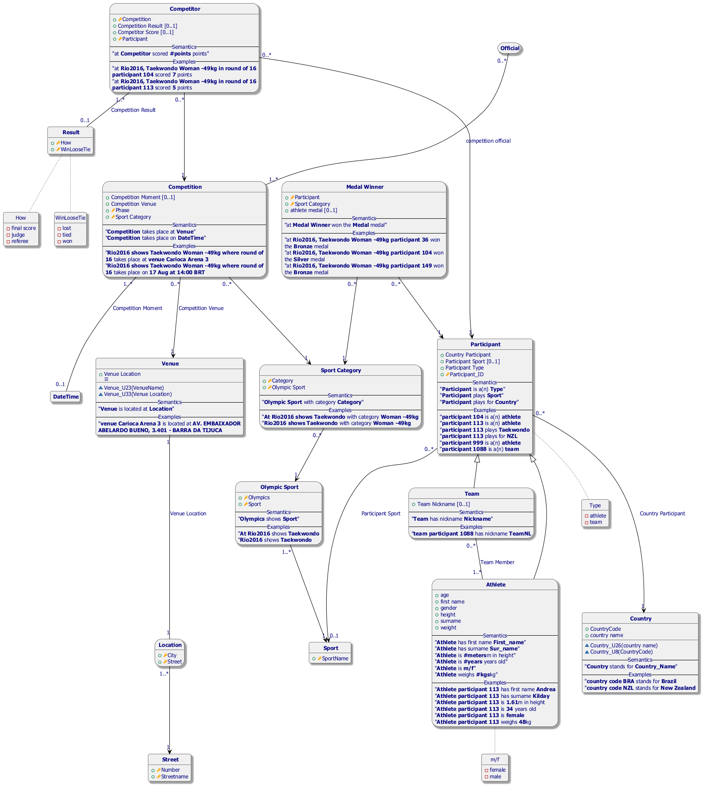
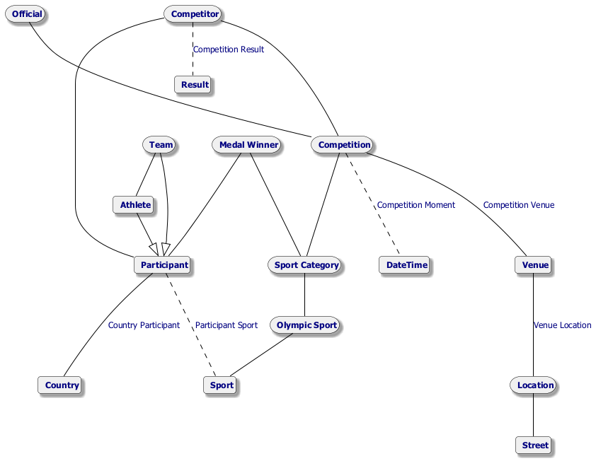
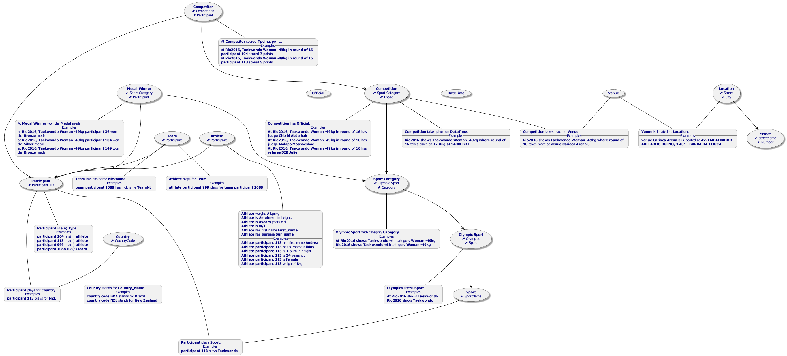
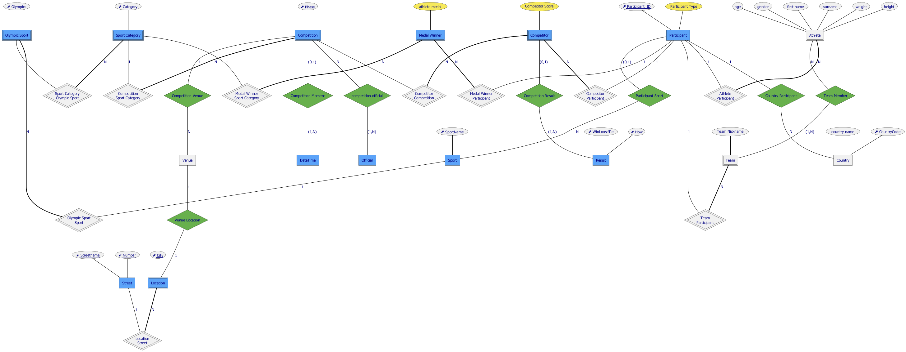
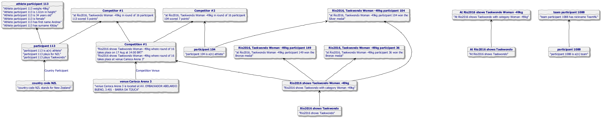

#  rio2016.prj
*Project created with CaseTalk v14.3 Build 1.57024.*

*  rio2016.prj

  *  rio2016.ig

    *  rio2016.exp

    *  rio2016.igd

## rio2016.igd / Fact Model

## rio2016.igd / Logical Model

## rio2016.igd / UML Classes

## rio2016.igd / Concept Map

## rio2016.igd / Object types

## rio2016.igd / Entity-Relation Model

## rio2016.igd / Knowledge Graph

