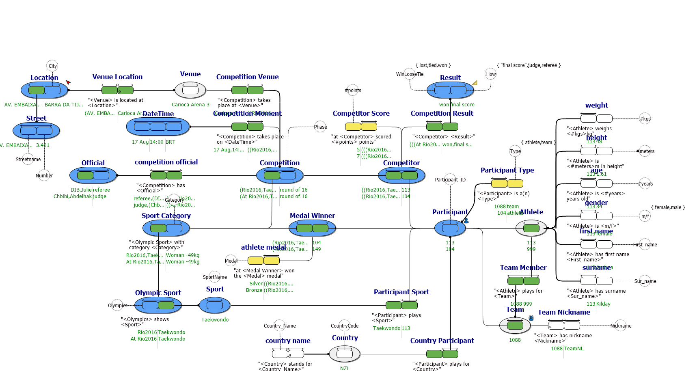

#  rio2016.prj
This example shows how a website, as published during the 2016 olympics, can be used in verbalizations to model the required information structure to generate a database for web publishing.

*Project created with CaseTalk v8.27, release 1, build 4349.*

* rio2016.prj
  * rio2016.ig
    * rio2016.exp
    * rio2016.igd
    * rio2016_GLR.igg
      * rio2016_GLR_SQL92.SQL
      * rio2016_GLR_XMLSchema.XSD
## rio2016.igd

