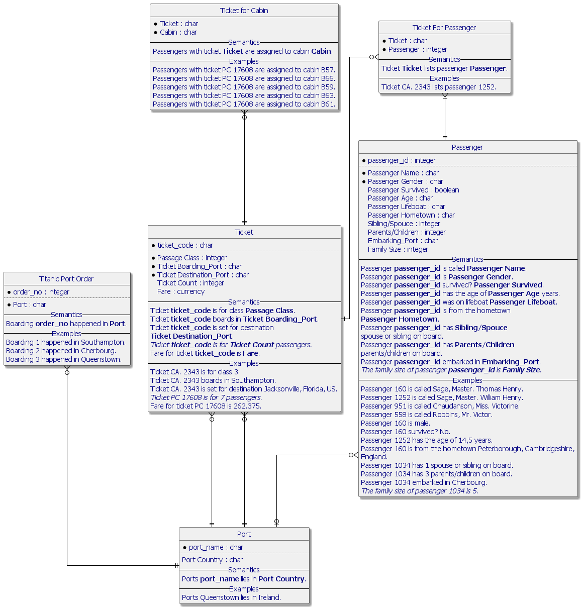
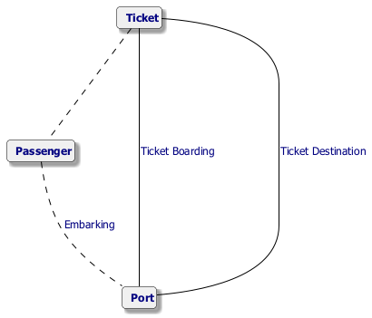

#  Titanic.prj
*Project created with CaseTalk v12.4 Build 2.28858.*

*  Titanic.prj
  *  titanic.ig
    *  titanic.exp
    *  titanic.igd
  *  titanic.xls
## titanic.igd

## titanic.igd /ERD

## titanic.igd /UML

## titanic.igd /MAP

