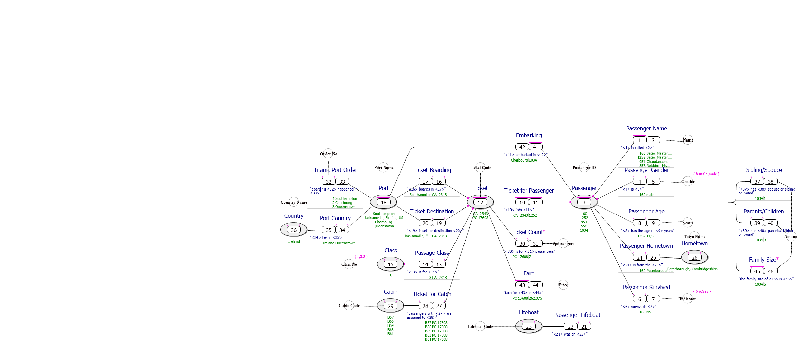
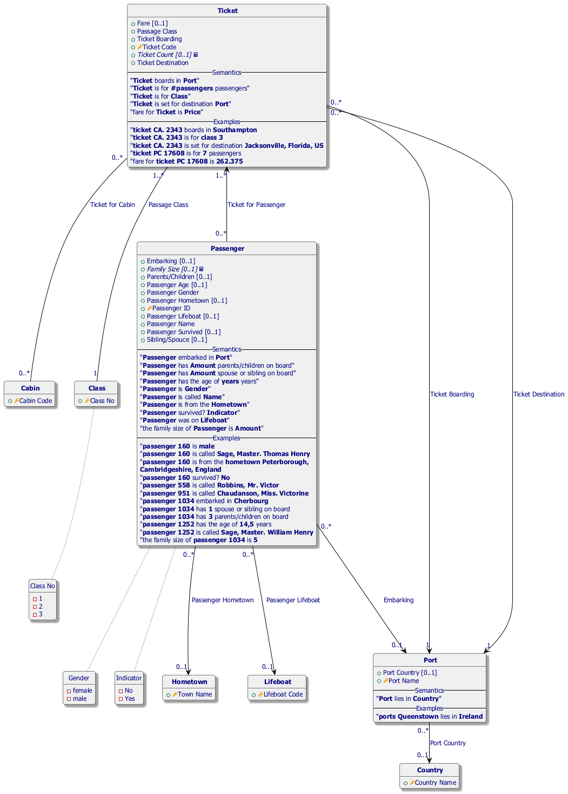

#  Titanic.prj
*Project created with CaseTalk v14.3 Build 1.57024.*

*  Titanic.prj

  *  titanic.ig

    *  titanic.exp

    *  titanic.igd

## titanic.igd / Fact Model

## titanic.igd / Logical Model

## titanic.igd / UML Classes

## titanic.igd / Concept Map

## titanic.igd / Object types

## titanic.igd / Entity-Relation Model

## titanic.igd / Knowledge Graph

  *  titanic.xls

