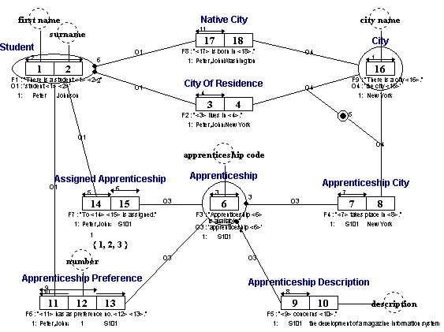

# EXAM_GLR.PRJ
Example used in the lessons of the FCO-IM Casetool manual.

*Project created with CaseTalk v8.27, release 1, build 4349.*

*  EXAM_GLR.PRJ
  *  EXAM_GLR.IG
    *  EXAM_GLR.IGD
## EXAM_GLR.IGD

