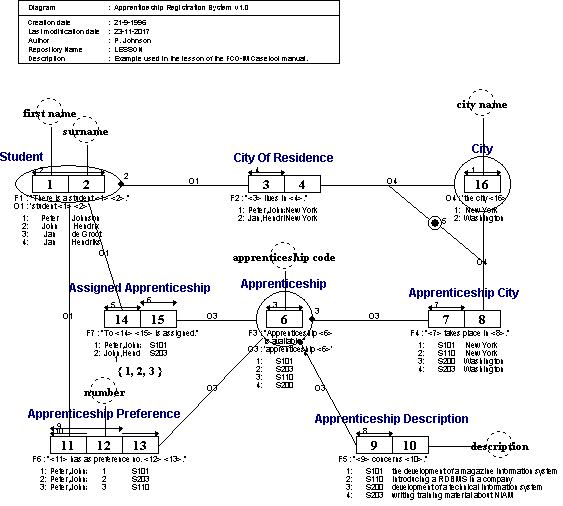

#  STEPS.PRJ
Project containing all steps from the FCO-IM Casetool manual lessons.

* STEPS.PRJ
  * STEP01.IG
  * STEP02.IG
  * STEP03.IG
    * STEP03A.IGD
  * STEP04.IG
    * STEP04A.IGD
  * STEP05.IG
    * STEP05A.IGD
  * STEP06.IG
    * STEP06A.IGD
  * STEP07.IG
    * STEP07A.IGD
  * STEP08.IG
    * STEP08A.IGD
  * STEP09.IG
    * STEP09A.IGD
  * STEP10.IG
    * STEP10A.IGD
  * STEP11.IG
    * STEP11A.IGD
  * STEP12.IG
    * STEP12A.IGD
  * STEP13.IG
    * STEP13A.IGD
  * STEP14.IG
    * STEP14A.IGD
  * STEP15.IG
    * STEP15A.IGD
  * STEP16.IG
    * STEP16A.IGD
  * STEP17.IG
    * STEP17A.IGD
  * STEP18.IG
    * STEP18A.IGD
  * STEP19.IG
    * STEP19A.IGD
    * STEP19.IGG
  * LESSON.EXP
## STEP19A.IGD

