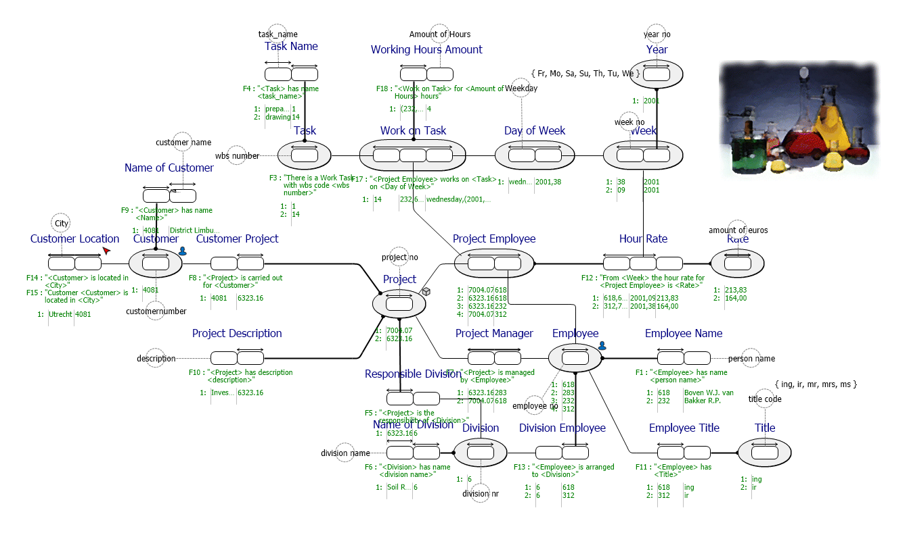

# WorkingHours.prj
A more realistic example where worksheets are verbalized and modeled. The model validation shows potential redundancy warnings.

*Project created with CaseTalk v8.27, release 1, build 4349.*

*  WorkingHours.prj
  *  WorkingHours.ig
    *  WorkingHours.igd
    *  WorkingHours.exp
    *  WorkingHours_GLR.igg
      *  WorkingHours_GLR_XMLSchema.XSD
      *  WorkingHours_GLR_SQL92.SQL
      *  WorkingHours_GLR_jsonTableSchema.JSON
    *  WorkingHours_RDF_OWL.rdf
## WorkingHours.igd

