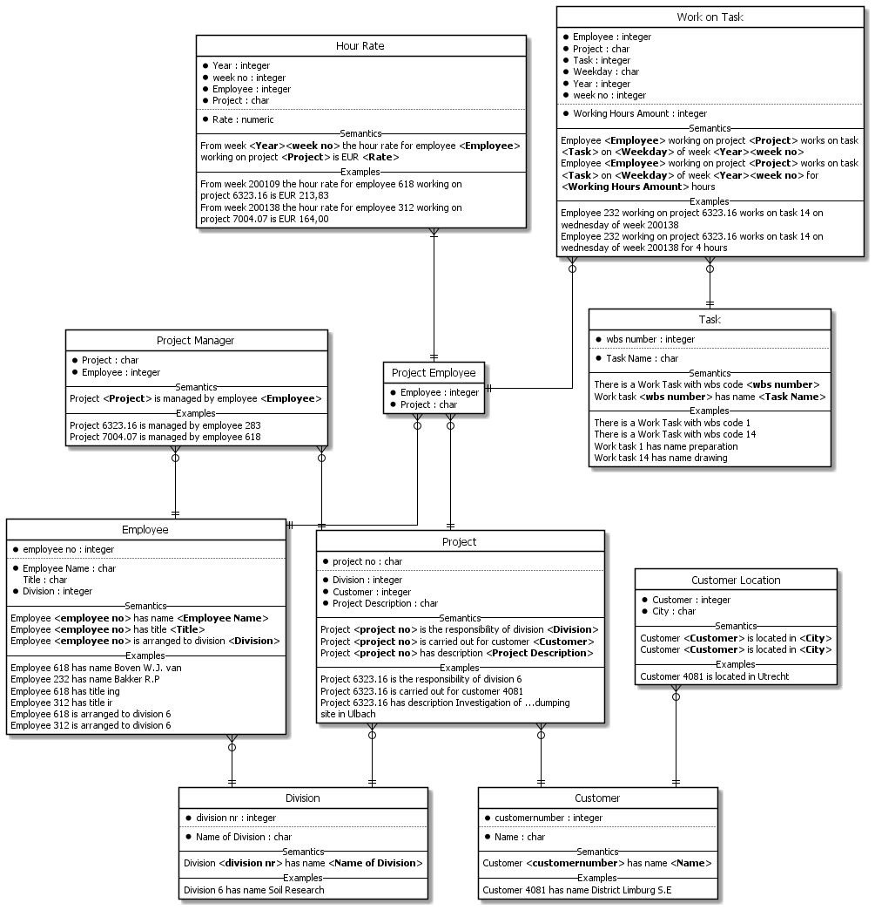
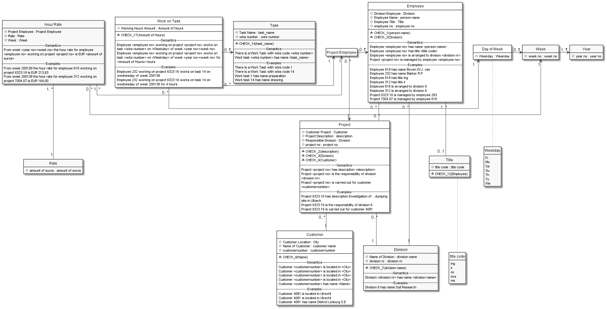
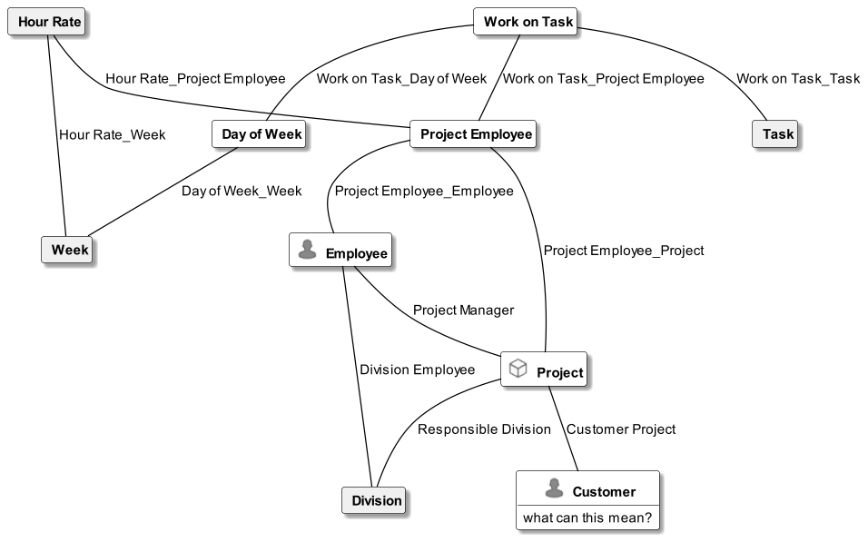

#  WorkingHours.prj
A more realistic example where worksheets are verbalized and modeled. The model validation shows potential redundancy warnings.

*Project created with CaseTalk v12.4 Build 2.28751.*

*  WorkingHours.prj
  *  WorkingHours.ig
    *  WorkingHours.igd
    *  WorkingHours.exp
## WorkingHours.igd

## WorkingHours.igd /ERD

## WorkingHours.igd /UML

## WorkingHours.igd /MAP

