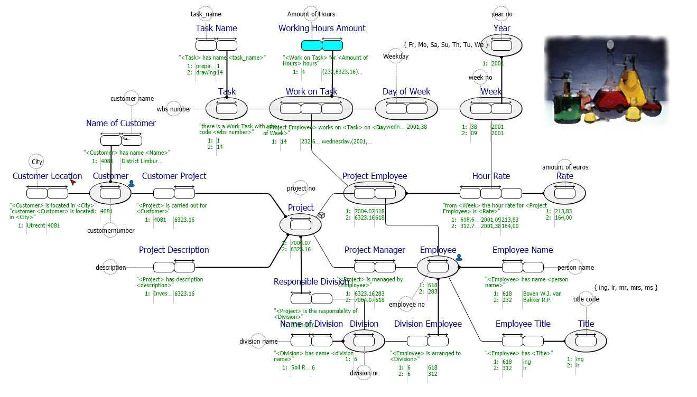

#  WorkingHours.prj
A more realistic example where worksheets are verbalized and modeled. The model validation shows potential redundancy warnings.

*Project created with CaseTalk v9.0 Build 0.4524.*

*  WorkingHours.prj
  *  WorkingHours.ig
    *  WorkingHours.igd
    *  WorkingHours.exp
    *  WorkingHours_GLR.igg
      *  WorkingHours_GLR_PowerDesigner.vbs
      *  WorkingHours-Logical.CRD
      *  WorkingHours-UML.CUD
      *  WorkingHours_GLR_Denodo.vql
      *  WorkingHours_GLR_jsonTableSchema.JSON
      *  WorkingHours_GLR_SQL92.SQL
      *  WorkingHours_GLR_XMLSchema.XSD
    *  WorkingHours_OWL2.rdf
    *  WorkingHours_UML2.uml
## WorkingHours.igd

## WorkingHours-Logical.CRD

## WorkingHours-UML.CUD

