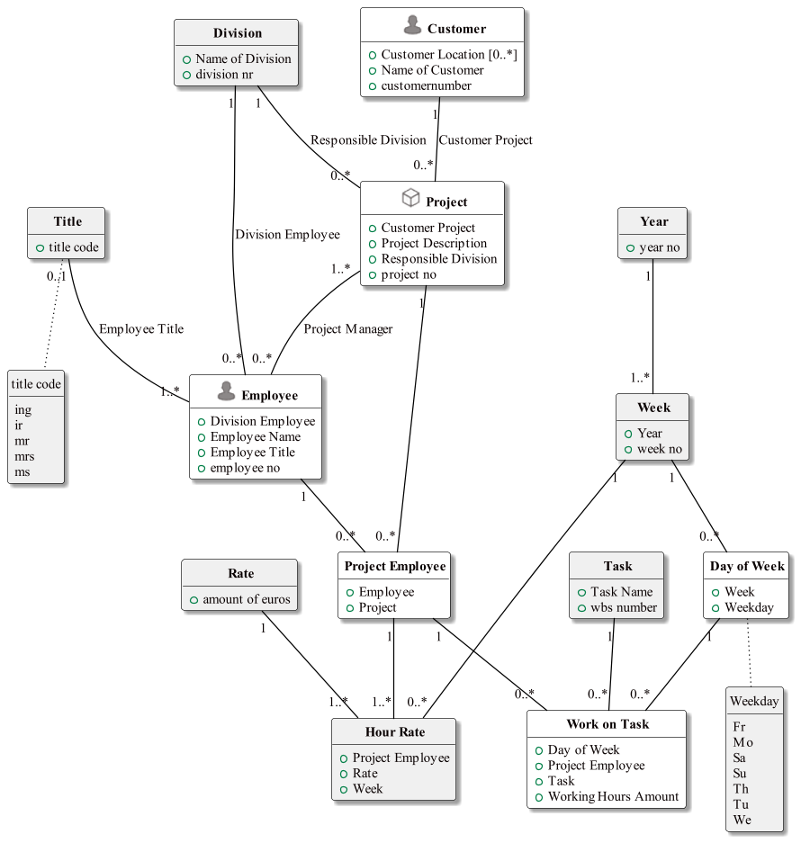
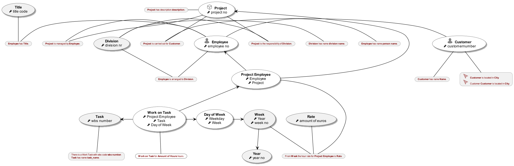

#  WorkingHours.prj
A more realistic example where worksheets are verbalized and modeled. The model validation shows potential redundancy warnings.

*Project created with CaseTalk v13.0 Build 2.55442.*

*  WorkingHours.prj
  *  WorkingHours.ig
    *  WorkingHours.igd
    *  WorkingHours.exp
    *  WorkingHours_Python.py
    *  WorkingHours_Python_access.py
## WorkingHours.igd

## WorkingHours.igd /ERD

## WorkingHours.igd /UML

## WorkingHours.igd /MAP

## WorkingHours.igd /EXP

