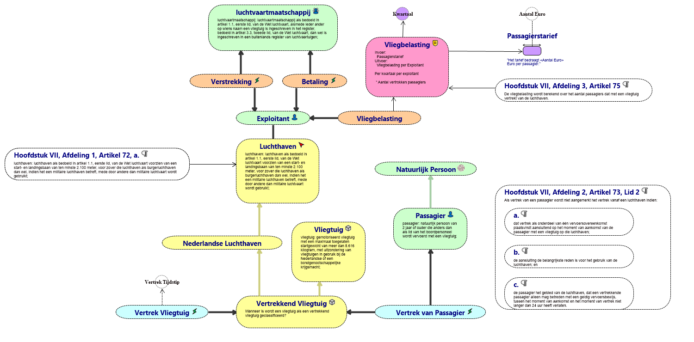
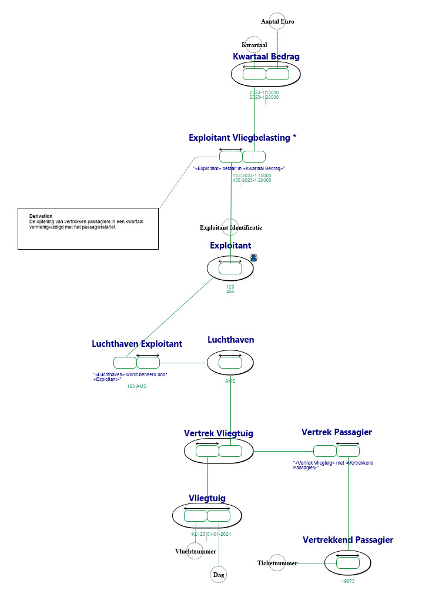
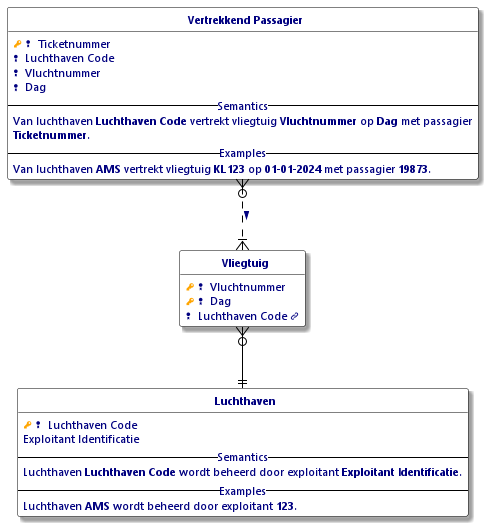
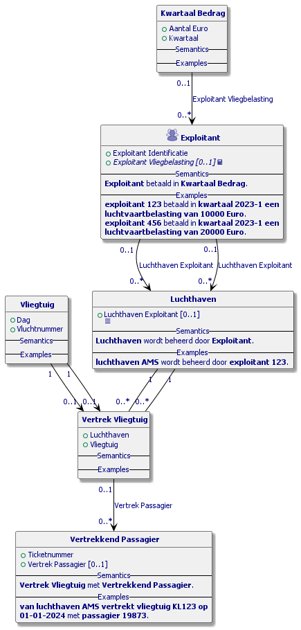
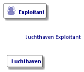
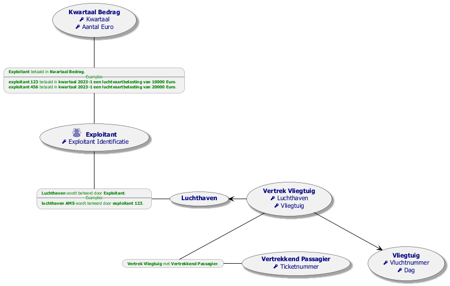

# Vliegbelasting.prj

*Project created with CaseTalk v13.4 Build 1.56293.*

* Vliegbelasting.prj

  * vliegbelasting.ig

    * vliegbelasting.exp

    * vliegbelasting.igd

## vliegbelasting.igd

## vliegbelasting-otfts.igd

## vliegbelasting-otfts.igd /ERD

## vliegbelasting-otfts.igd /UML

## vliegbelasting-otfts.igd /MAP

## vliegbelasting-otfts.igd /EXP

  * BWBR0044580_2021-01-01_0.xml

  * BWBR0007168_2024-01-01_0.xml
