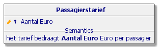
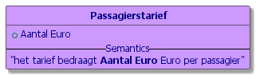
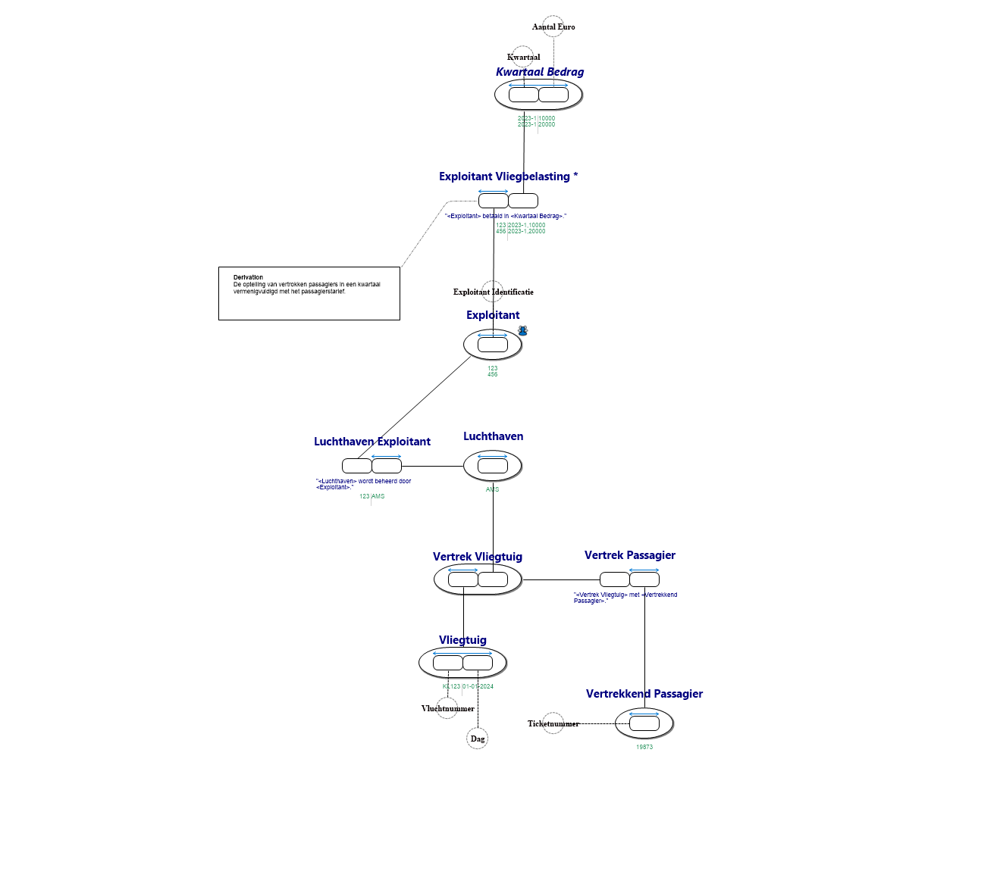
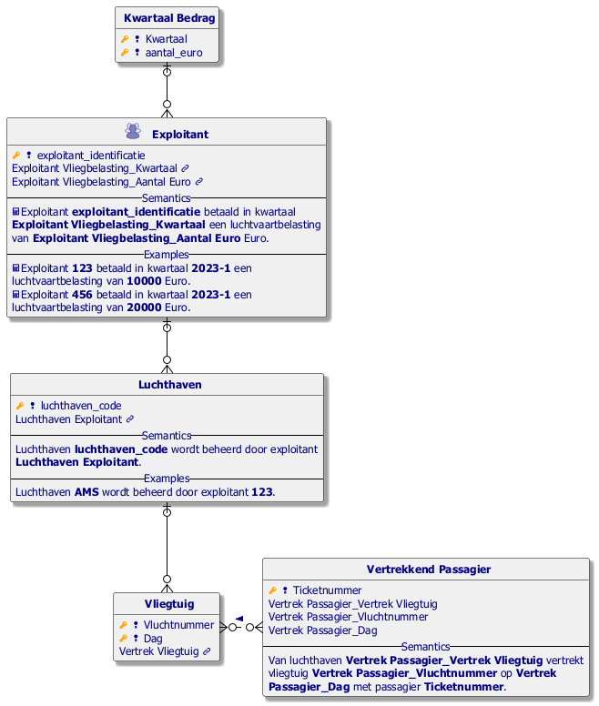
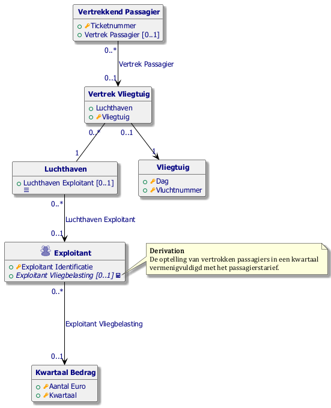
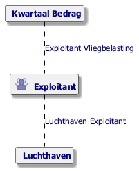

#  Vliegbelasting.prj
*Project created with CaseTalk v14.0 Build 0.56609.*

* Vliegbelasting.prj

  * vliegbelasting.ig

    * vliegbelasting.exp

    * vliegbelasting.igd

## vliegbelasting.igd

## vliegbelasting.igd /ERD

## vliegbelasting.igd /UML

## vliegbelasting.igd /MAP

## vliegbelasting.igd /EXP

    * vliegbelasting-otfts.igd

## vliegbelasting-otfts.igd

## vliegbelasting-otfts.igd /ERD

## vliegbelasting-otfts.igd /UML

## vliegbelasting-otfts.igd /MAP

## vliegbelasting-otfts.igd /EXP

    * Passagierstarief.igd

## Passagierstarief.igd

  * BWBR0044580_2021-01-01_0.xml

  * BWBR0007168_2024-01-01_0.xml

